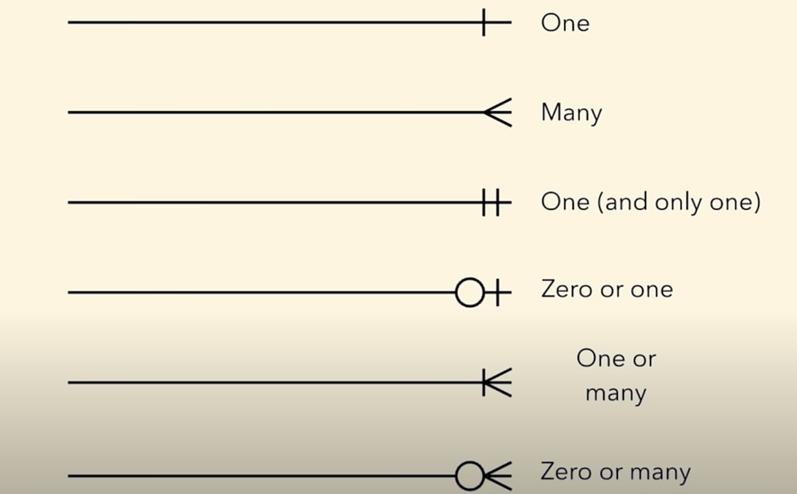

# Entity Relations Diagrams (ERDs)

### Entity
An Object Tracked in a DataBase.
Ex: Person, Order, Thing

### Attributes
Entities have attributes. Properties or Traits.
Ex: Person can have attribute like FirstName, LastName, etc
    Order can have attributes (Properties) like order_number, CustomerID, etc

Note: Entities in a Database will be depicted as rows and attributes will be depicted as columns.

#### Primary Keys
An Attribute or field that uniquely identifies every record within a certain table.

#### Foreign Keys
Same as primary key but it is located in foreign place(Foreign Table).
- Foreign key need not be unique
- A table can have multiple foreign key.

### Relationships
It describes how these entities will interact with each other.

### Cardinalities
It helps define the realtionship in numerical context.

