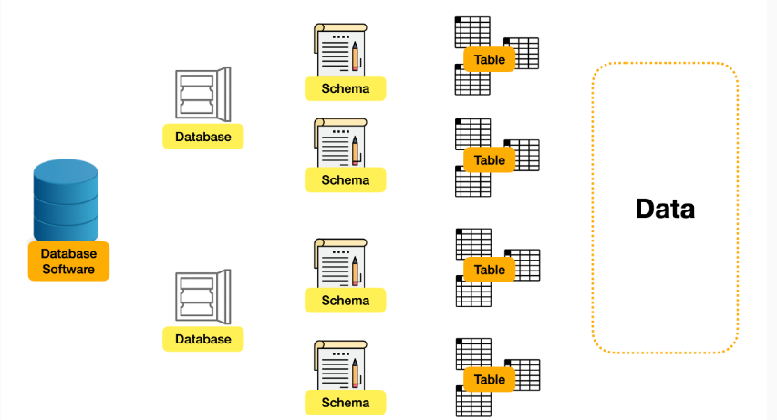

### Installing MySQL Server (Ubuntu)

```
<u>sudo apt update</u>
<u>sudo apt install mysql-server</u>
```

### To check the status of MySQL Server
```
<u>sudo systemctl status mysql.service</u>
```

### To start the MySQL Server
```
<u>sudo systemctl start mysql.service</u>
```

### To enter MySQL shell
```
<u>sudo mysql</u>
```

### Set up configuration 
```
<u>sudo mysql_secure_installation</u>
```

### Setup password USER using ALTER Command
```
<u>ALTER USER 'root'@'localhost' IDENTIFIED WITH mysql_native_password BY '<enter password>';</u>
```

====================================================================================================
### Database architecture



=====================================================================================================

SQL (Structured query Langauge)
*It is used to query the data from relational database*


## SQL Syntax

### _Syntax related to Database_

Get the list of all the databases currently present.
```
SHOW DATABASES;
```

Create a database
```
CREATE DATABASE <name_of_database>;
```

Drop the database
```
DROP DATABASE <name_of_database>;
```

Connect with database
```
USE <name_of_database>;
```


### _Syntax related to tables in Database_

Show various tables in database
```
SHOW tables;
```

See schema of table
```
DESCRIBE <name_of_table>;
DESC <name_of_table>
```

Drop the table
```
DROP table <name_of_table>
```


### CRUD Operation
C: Create: INSERT statements \
R: Read: SELECT statements \
U: UPDATE statements \
D: DELETE statements


Create a table in database
```
CREATE TABLE <name_of_table>
(
    col_name1 datatype1 CONSTRAINT1,
    col_name2 datatype2 CONSTRAINT2,
    col_name3 datatype3 CONSTRAINT3
);
```

#### Datatypes in SQL

##### Strings datatype
|DataType      | Description                                         |
|:-------------|:----------------------------------------------------|
|CHAR(SIZE)    | It is used to specify a fixed length string that can contain numbers, letters, and special characters. Its size can be 0 to 255 characters. Default is 1. |
|VARCHAR(SIZE) | It is used to specify a variable length string that can contain numbers, letters, and special characters. Its size can be from 0 to 65535 characters. |
|BINARY(SIZE) | It is equal to CHAR() but stores binary type strings. Its size parameter specifies the column length in the bytes. Default is 1. |
|VARBINARY(Size) | It is equal to VARCHAR() but stores binary byte strings. Its size parameter specifies the column length in the bytes. Default is 1. |
|TEXT(SIZE) | It holds a string that can contain a maximum length of 255 characters. |
|TINYTEXT | It holds a string with a maximum length of 255 characters. |
|MEDIUMTEXT | It holds a string with a maximum length of 16,777,215. |
|LONGTEXT | It holds a string with a maximum length of 4,294,967,295 characters. |
|ENUM(Vval1, val2, ...) | It is used when a string object having only one value, chosen from a list of possible values. It contains 65535 values in an ENUM list. If you insert a value that is not in the list, a blank value will be inserted. |
|SET(val1, val2, ...) | It is used to specify a string that can have 0 or more values, chosen from a list of possible values. You can list up to 64 values one time in a SET list. |
|BLOB(SIZE) | It is used for BLOBs (Binary Large Objects). It can hold up to 65,535 bytes. |

##### Numeric datatype
|DataType      | Description                                         |
|:-------------|:----------------------------------------------------|
|BIT(SIZE)    | It is used for a bit-value type. The number of bits per value is specified in size. Its size can be 1 to 64. The default value is 1. |
|INT(SIZE) | It is used for integer values. Its signed range varies from -2147483648 to 2147483647 and unsigned range varies from 0 to 4294967295. The size parameter specifies the max display width that is 255. |
|INTEGER(SIZE) | It is equal to INT(SIZE) |
FLOAT(size, d) | It is used to specify a floating point number. Its size parameter specifies the total number of digits. The number of digits after the decimal point is specified by _d_ paramter. |
|FLOAT(p) | It is used to specify a flaoting point number. MYSQL used _p_ parameter to determine whether to use FLOAT or DOUBLE. If _p_ is between 0 to 24, the datatype becomes FLOAT(). If p is from 25 to 53, the datatype becomes DOUBLE(). |
|DECIMAL(SIZE, D) | It is used to specify a fixed point number. Its size parameter specifies the total number of digits. The number of digits after the decimal parameter is specified by _d_ paramter. The maximum value for size is 65, and the default value is 10. The maximum value for _d_ is 30, and default value is 0. |
|DEC(SIZE, d) | It is equal to DECIMAL(SIZE, D) |
|BOOL | It is used to specify Boolean value TRUE or FALSE. Zero is considered as FALSE, and nonzero values are considered as TRUE. |

##### DATE and TIME datatype
|DataType      | Description                                         |
|:-------------|:----------------------------------------------------|
|DATE | It is used to specify date format YYYY-MM-DD. Its supported range is from '1000-01-01' to '9999-12-31' |
|DATETIME(fsp) | It is used to specify date and time combination. Its format is YYYY-MM-DD hh:mm:ss. Its supported range is from '1000-01-01 00:00:00' to '9999-12-31 23:59:59' |
TIMESTAMP(fsp) | It is used to specify the timestamp. Its value is stored as the number of seconds since the Unix epoch('1970-01-01 00:00:00' UTC). Its format is YYYY-MM-DD hh:mm:ss. Its supported range is from '1970-01-01 00:00:01' UTC to '2038-01-09 03:14:07' UTC |
|TIME(fsp) | It is used to specify the time format. Its format is hh:mm:ss. Its supported range is from '-838:59:59' to '838:59:59' |
|YEAR | It is used to specify a year in four digit format. Values allowed in four digit format from 1901 to 2155, and 0000. |


#### Constraints in SQL
|Constraint    | Description                                         |
|:-------------|:----------------------------------------------------|
|NOT NULL |  |

Inserting values in tables
```
INSERT INTO <table_name(colName1, colName2, colName3)> VALUES (colValue1, colValue2, colValue3),
(colValue1, colValue2, colValue3),
(colValue1, colValue2, colValue3);
```

Read all columns from table
```
SELECT * FROM <table_name>;
```

Read specified columns from table
```
SELECT <colName1>, <colName2> FROM <tableName>;
```

Check current database
```
SELECT database();
```

List all the schemas
```
SELECT schema();
```

Filter clause
<!-- Filter clause on strings are case insensitive !-->
```
SELECT 
    <colName1>, 
    <colName2> 
FROM <tableName>
WHERE 
    <colName1> = <value1>
```

Case sensitive filter clause
```
SELECT 
    <colName1>, 
    <colName2> 
FROM <tableName>
WHERE 
    BINARY <colName1> = <value1>
```

ALIAS in SQL
```
SELECT
    firstname AS fname,
    lastname AS lname
FROM
    <tableName>
```

UPDATE STATEMENTS IN SQL
```
UPDATE <tableName>
SET
    <colName> = <colValue>
WHERE
    <colName2> = <colValue2>
```

DELETE STATEMENT IN SQL
```
DELETE * FROM <tableName>
```

ALTER COMMANDS IN SQL
USECASES: \
1. Add a new column \
```
    ALTER TABLE <tableName>
    ADD COLUMN
        <colNametoAdd> <datatype>
```

    2. DROP a column \
        ```
        ALTER TABLE <tableName>
        DROP COLUMN
            <coltoDrop>
        ```
    
    3. Modify the column \
        ```
        ALTER TABLE <tableName>
        MODIFY COLUMN
	        <colName> datatype;
        ```

DDL vs DML \
DDL: Data Definition Language: Changes the table structure \
Ex: CREATE, ALTER, DROP, TRUNCATE \

DML: Data Manipulation Language \
Ex: INSERT, UPDATE, DELETE \


Difference between TRUNCATE and DELETE \
TRUNCATE (DDL): Remove all the records from table and recreate it \
DELETE (DML): Deletes records one by one hence inefficient \


DISTINCT Command
```
SELECT DISTINCT 
    colName1, 
    colName2
FROM
    tableName
```

ORDER BY Command
```
SELECT
    *
FROM
    tableName
ORDER BY colName1 DESC;
```

LIMIT Command
```
SELECT
    *
FROM tableName
ORDER BY
    colName1 ASC,
    colName2 DESC
LIMIT 10;
```

```
SELECT
    *
FROM tableName
ORDER BY
    colName1 ASC,
    colName2 DESC
LIMIT <startOfRow>, <numOfRows>;
```

REGEXP in SQL
```
SELECT 
    *
FROM
    employee2
WHERE
    colName REGEXP 'regexp_pattern';
```

LOGICAL Operator in SQL \
    1. _=_ : Equal to \
    2. _!=_ or _<>_ : Not equal to \
    3. _LIKE <keyword>_  \
    4, _NOT LIKE <keyword>_ \
    5. _AND_ \
    6. _OR_ \
    7. _IN ('word1', 'word2')_ \
    8. _NOT IN ('word1', 'word2')_ \


CASE STATEMENTS 
```
SELECT
    col1,
    col2,
    CASE
        WHEN <condition1> THEN <value1>
        WHEN <condition2> THEN <value2>
        ELSE value3
    END AS col3
FROM
    <table_name>
```


JOINS in SQL
```
SELECT
    a.col1,
    b.col2,
    a.vcol3
FROM
    table1 AS a
        <TYPE OF JOIN> JOIN
    table2 AS b
    ON a.common_col1 = b.common_col2
```

TYPES of JOINS
1. DEFAULT is INNER join
2. LEFT JOIN or LEFT OUTER JOIN: Same
3. RIGHT JOIN
4. OUTER JOIN: can also be UNION between LEFT and RIGHT outer JOIN
5. CROSS JOIN: Multiply the table, DEFAULT if no condition for JOIN is provided


DIfference between WHERE and HAVING Clause \
WHERE: Is used to filter individual records before GROUPBY clause \
HAVING: is used after aggregation to filter out \


Create new table from existing table
```
CREATE
    TABLE new_table
    AS
    SELECT
        * 
    FROM
        existing_table
```

OVER and PARTITION BY Clause
```
SELECT
    col1,
    col2,
    COUNT(agg_col) OVER (PARTITION BY part_col)
FROM
    table1
```

ROW NUMBER
```
SELECT
    col1,
    col2,
    ROW_NUMBER() OVER (ORDER BY order_col DESC)
FROM
    table
```

RANK and DENSE Rank \
Rank: Gives same number to same value and continues like row_number \
Ex: \
|Name    |class   |Rank|
|:------:|:------:|---:|
|Abhi    |1       |1   |
|Rahul   |1       |1   |
|Pathak  |2       |3   |

DENSE RANK: Gives same number to same value and resumes from latest rank \
Ex: \
|Name    |class   |Rank|
|:------:|:------:|---:|
|Abhi    |1       |1   |
|Rahul   |1       |1   |
|Pathak  |2       |2   |


INDEXES and ORDER OF EXECUTION \
There are two ways SQL search for data: \
1. SEEK: Based on index
         Generally Primary keys are inserted in order and search can happen faster using indexes

         INDEX are of 2 types:
            1. Clustered Index
                There can be only one clustered index.
                It can be from single column or multiple column

            2. Non Clustered Index
                a. Creates a index table, where column in   kept in sorted order
                b. First it retrieves information from index and search in the main table
                c. It is 2 step process
2. SCAN: Search the entire table
         SQL searches the entire data


<b>Way to read a plan: \
It is read from Right to LEFT and Top to Bottom </b>


Common Table Expression (CTE)
1. It is used to simplify queries
2. It improves readability of queries

```
WITH
    new_table1 (req_col1, req_col2) AS (
        SELECT
            col1,
            col2
        FROM    
            table1
    )

    new_table2 AS (
        SELECT
            req_col1
        FROM 
            new_table1
    )

SELECT req_col1 FROM new_table2
```

a. From WITH till SELECT it is a single query \
b. CTE stores table in memory \
c. CTE defines a temporary result set that can be referred in \
    SELECT, INSERT, UPDATE, DELETE statements, immediately followed by CTE expressions \
d. CTE can improve the performance (Not always) \
e. On CTE indexes are non performant


### Questions
1. Create a note about  constraint  and Keys in SQL
2. Understand all usecase of ALTER command
3. Understand the difference between DELETE, TRUNCATE and DROP 
4. Understand LIKE operator in SQL
5. str_to_date functions


