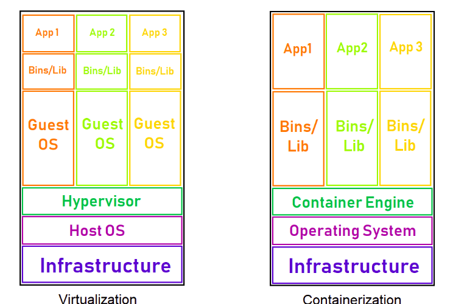

[Source](https://www.youtube.com/watch?v=1UHPfDbmZZ4&list=PL0xeHY_ImQVWZMJ-HF3I2GErIeEl4ca2b&index=2)

#### What is Docker?
Docker is a container management tool.


#### What is container?

Container is a fully independent APP run time environment with their own resources.

Container is INIT of ONE USER NS, ONE NET NS, ONE ONE PID NS, ONE MOUNT NS
powered by kernel with the help of Docker.
   
#### What are the components/resources needed for any app to run?
- Hardware (CPU + RAM + Storage)
- OS (on top of Hardware)
	 - Kernel: A kernel is a computer program at the core of a computer's operating system that has a complete control over everything on computer system.
	 
	- CGROUPS: It is a Linux kernel feature that limits, accounts for,  and isolates the resource usage of a collection of processes.


- Number of users, Mount and PID needed for an app to run.

|             |NEED IT              |ALLOWED BY OS            |Can actually get it?|
|:--------|:-----------------:|:--------------------------:|---------------------|
|USER     |  1                       | Multiple                         | Multiple                | 
|MOUNT | 1                       | 1                                     | Multiple                |
|PID        | 1                        | 1                                     | Multiple               |
|NET       | 1                        | 1                                     | Multiple               |

- Why is only 1 MOUNT, PID and NET is allowed by OS?
    Because of concept of Personal Computing.

- STORAGE: FILE SYSTEM == MOUNT
   Collection of files/directories for specific purpose.
   - Types of file system:
		1. BOOT FILE SYSTEM aka Kernel file system
		2. ROOT FILE SYSTEM
		3. USER FILE SYSTEM
		4. APP FILE SYSTEM

  

#### Evolution of Computing

   Physical Server -> Virtualization -> Containerization

  Difference between Virtual machines and Container:




#### What is container?: Prove it
When we run Docker Image:
   - One USER NS get Initialized
   - USER is process so container is a process.
   - Container creates USER Isolation for apps inside it
			
   - One Copy of IMAGE get attached to USER NS.
   - One Network get attached to USER NS.
   - One PID get attached to USER NS.


#### How to use a container?

Rule: 
   - Physical Server is running because PID 1 is running. PID 1 is systemD
   - Virtual server is running because PID 1 is running. PID is systemD
   - Container is running because PID 1 is running. PID can be ANYTHING (JAVA, PYTHON, PERL,    RUBY, BASH, ...)


#### RUN Commands:
```
docker run
```
   - pull -> create -> start -> Become CONTAINER PROCESS PID 1 or ATTACHED TO THE CONTAINER

```
docker run -d
```
  - pull -> create -> start -> Do not Become CONTAINER PROCESS PID 1 or DO NOT GET ATTACHED TO THE CONTAINER

What do you do with Compute unit?
   - exec: 
        - Would execute an Executable INSIDE a container
	 - With -it && /bin/bash - You can go inside container

```
docekr exec <container_name> <command>
docker exec 9agf36ddd ls  [List the directory from inside container]
docker exec -it <container_name> /bin/bash  [Creates a terminal inside terminal]
```

   - attach:
         - Get attached to container.

   - going inside container 
```
docker run -it ubuntu /bin/bash
```
   
   - How to come out of container without exiting when you are a BASH?
	   ```
	   Ctrl + P + Q
	   ```

- Access from Outside
	```

	docker run -d -p 8080:8080 jenkins
					hostport:contport
	```

- Copying file from host machine to host and vice versa.
	```

	docker cp path/to/file/in/host/machine container_id:path/to/file/in/container

	docker cp container_id:path/to/file/in/container path/to/file/in/host/machine
	``` 

- diff: Inspect changes to files or directories on a container's filesystem since a container got created 
   - using diff commands
       - you can see
          - ANY FILES GOT CHANGED
          - GOT ADDED
          - GOT CHANGED
```
	docker diff <container_id>
```

- inspect: Return low level information on Docker Objects
   - used for:
		- Container
		- Image
		- Network
		- Volume

- Docker monitoring commands:
	- logs: Fetch the logs of container
	- ps: List containers
	- stats: Display a live stream of container (s) resource usage statistics
	- top: Display the running process of containers
	- events: Get real time events from server


#### Docker Volume

How to get container data persisted BEYOND a lifecycle of container:
   - Docker Volume
        - Is a way to attach/mount a location directory in the container. 
          You store data in a container in that directory, when the container is done data would be persisted in that location.

   - Type of Docker Volume:
        - volume: /var/lib/docker/volumes
        - mountfs: ANYHWERE in HOST MACHINE
        - tempfs: In Memory

```
docker volume create <volume-name>
```

```
docker run -v <volume_name>:<path/in/docker> <container_id>
# This will keep copies of all the file present in <path/in/docker> to /var/lib/docker/volumes/<volume-name>
   
docker run -v <path/in/host/machine>:<path/in/docker> <container_id>
# This will keep copies of all the file present in <path/in/docker> to path/in/host/machine
```


#### Docker Networking
How a container can be accessible over network?
   - Each container by default get one NET NS (ONE IP)

```
	docker network ls
	# Lists all the available network
```
- Driver in networks:
	- Bridge 
	- Host: Container do not get any network NS by default, it shares the same network as host  machine
	- Null: Container do not get any network NS

Note: If no network is specified then container will be get assigned BRIDGE network

```
	docker run --net=<network_name> <container_name> 
```

```
	docker network connect <network_name> <container_id>
```


#### Docker Images

Types of FILE system:
- BOOT File system aka Kernel file system
- ROOT file system
- USER File system
- APP File system

Docker Image:
   - Collection of File system(s)
	- Such as:
		- ROOT File system such as fedora, ubuntu
		- USER File system such as tomcat, MySQL
		- APP File system such as tomcat, MySQL

   - Copy of each Image gets Mounted to each container.

   - A docker image is made up of filesystems layered over each other.
	- Image: 
		- Layer 0 (Image 0) (Root file system: Ubuntu, Fedora) 
		- Layer 1 (Image 1) (App file System) 
		- Layer 2 (Image 2) (Updates of Root file system)

           - Note: Since Each layer is an Image, they all get Unique ID (UUID)

       - From single image multiple containers can be created.

   - An entire Image is divided into 3 Parts:
	   - Image:
		            - Merged: When different layer of Image are merged, it goes into merged directory.
		            - Diff: Whenever a change is made, changes are stored into Diff directory

	   - A Merged layer gets Mounted to one USER, PID, and Network

	   - When a container is stopped then USER, PID, Network gets disappeared. 
	   - When a container is restarted, Image layer file is already there and diff files are also there, using those information containers are recreated.

   - Image has layer:
	- Layer:
		- Data Layer
					- files/dirs
		- Meta Layer
					-  ENV, VOLUME, PORT, PID, USER

   - Higher layers always win when there is conflicts in Layers
   - Image Layering is accomplished through  Union mounts
	   - Union mounts: Allows to mount multiple files system over top of each other but combining all of the layers into a single view, giving the application/OS single regular filesystem.
   - All layers are read only except top layers.

- How to build images?
	1. Using existing containers
		1. Manual
		2. ONE LAYER at a time
	2. Using Dockerfile
		1. Automated process
		2. Multiple layer at one time


#### Example 
Give me a Image
   - Requirement
		- Ubuntu base
		- Git
		- Apache 2
		- Java
	
- Step 1: Create a base Image
- Step 2: Go into container and install the requirements
- Step 3: Commit it to create a new Image

```
docker commit -m "<message>" -a "<author>" <container-id> <image_name_in_lowercase>
```

   - How to share images?
	   - Using TAR ball: 
	     ```
	     docker save -o <image-name.tar> <image_which_need_to_be_saved>
	     docker load -i <image-name.tar>
	     ```
	   - Using Artifactory
			   - Using hub.docker.com
					- Register a account with email ID and validate it: hub.docker.com
					- Create a empty repo
					- Docker login
					- Docker tag - local repo name must match with repo name of hub.docker.com
					- docker push
	   - Using Dockerfile:
			- What is Dockerfile?
				 - file
				 - With lines of instructions
				 - Each line - Create ONE Layer
				 - Each layer - Created from container from previous Line's Layer 
            
	      - Example of Dockerfile

		```

		FROM ubuntu
		MAINTAINER Abhinandan Pathak <email@id>
		RUN apt update && apt install git -y
		COPY devops.war /opt
		ENV JAVA_HOME=/opt/xyz
		```

		- To build image from Dockerfile
```
	docker build -t img1 . 
	# This command build the image from file named "Dockerfile"
	
	docker build -t img1 -f <filename>
	# This command build the image from file named <filename>
```
